<picture>
  <source media="(prefers-color-scheme: dark)" srcset="../assets/banner-dark.svg">
  <source media="(prefers-color-scheme: light)" srcset="../assets/banner-light.svg">
  
</picture>

 

 

**COPA turns state-of-the-art AI capabilities into tailor-made decision
intelligence products** that change how organizations deliver services,
manage knowledge, and make decisions — one adaptable intelligence
architecture, configured for strategic, institutional, regulatory,
commercial, and operational decision environments.

*Intellectual rigor · practical usefulness · responsible innovation · long-term autonomy*

---

## 🔬 Open research — an LLM ecosystem for Armenian

A complete, auditable LLM ecosystem for Armenian, accompanying the paper
***From Zero to Hero: An Open LLM Ecosystem for Armenian*** (arXiv forthcoming):

| | Artifact | What it is |
|---|---|---|
| 🛠️ | [**armenian_llm_ecosystem**](https://github.com/COPATeam/armenian_llm_ecosystem) | Full reproduction code — corpus pipeline, translate-and-verify, CPT recipes, evaluation (MIT) |
| 📰 | [**ArmWeb**](https://huggingface.co/datasets/COPA-AI/armweb) | 4.37M-document (1.15B-token) curated Armenian news corpus, deduplicated and benchmark-decontaminated |
| 🧮 | [**ArmSTEM**](https://huggingface.co/datasets/COPA-AI/armstem) | 373K verified parallel EN–HY math and science problems with step-by-step solutions |
| 🤖 | [**arm-gemma-e4b**](https://huggingface.co/COPA-AI/arm-gemma-e4b) | Gemma-4-E4B adapted to Armenian — first open Armenian LLM with its complete training corpus and recipe |

All Hugging Face artifacts live in the
[**Armenian LLM Ecosystem collection**](https://huggingface.co/collections/COPA-AI/armenian-llm-ecosystem-6a98b17dab8c0e49af0add0d)
under the [COPA-AI organization](https://huggingface.co/COPA-AI).

## 🏛️ Projects

- [**Parlour**](https://parlour.copa.team) — parliamentary intelligence platform.

From decision to working pilot in two weeks · <a href="https://copa.team">copa.team</a>

